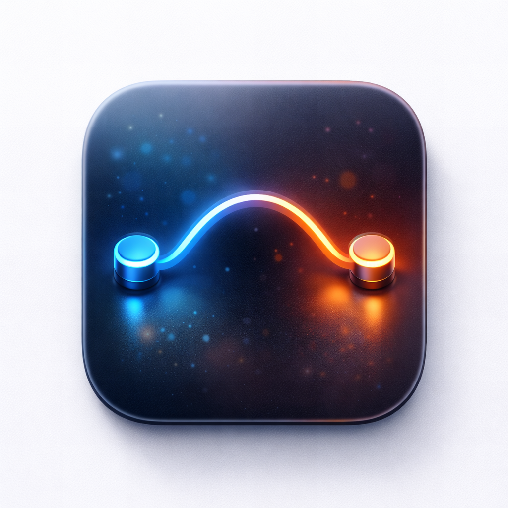

<p align="center">
  
</p>

<h1 align="center">SoundBridge</h1>

<p align="center">
  A free, open-source macOS system-wide volume controller for HDMI and DisplayPort monitors.
</p>

<p align="center">
  <a href="https://github.com/chenjy16/SoundBridge/releases">Download</a> · 
  <a href="#how-it-works">How It Works</a> · 
  <a href="#building-from-source">Build</a>
</p>

---

## Why SoundBridge?

Many external monitors connected via HDMI or DisplayPort have fixed-volume audio output — macOS shows the volume slider grayed out. SoundBridge solves this by inserting a virtual audio driver between your apps and the physical device, giving you full software volume control through the menu bar.

No kernel extensions. No background daemons you can't see. Just a lightweight menu bar app.

## Features

- System-wide volume control for fixed-volume HDMI/DisplayPort audio
- Menu bar app with volume slider and mute toggle
- Keyboard volume keys work as expected
- 10-band parametric EQ with preset support
- Automatic device detection and hot-plug support
- Universal binary (Apple Silicon + Intel)
- Guided onboarding with one-click driver install
- Auto-update via Sparkle
- Code signed and notarized

## Requirements

- macOS 13.0 (Ventura) or later
- HDMI or DisplayPort audio output

## Installation

1. Download the latest `.dmg` from [Releases](https://github.com/chenjy16/SoundBridge/releases)
2. Drag `SoundBridge.app` to Applications
3. Launch SoundBridge — the onboarding wizard will guide you through driver installation
4. Your HDMI/DisplayPort audio device will appear with a working volume slider

To uninstall, use the "Uninstall" option in the SoundBridge menu bar dropdown.

## How It Works

SoundBridge uses a four-component architecture:

```
┌─────────────────┐     ┌──────────────────────┐     shared memory     ┌─────────────────┐     ┌─────────────────┐
│   Menu Bar App   │────▶│   HAL Virtual Driver  │◀──────────────────▶│   Host Engine    │────▶│  Physical Device │
│   (SwiftUI)      │     │   (C++ CoreAudio)     │    /tmp/soundbridge  │   (Swift)        │     │  (HDMI/DP)       │
└─────────────────┘     └──────────────────────┘                      └─────────────────┘     └─────────────────┘
       UI controls              Proxy device                            DSP + rendering
       volume/mute              captures audio                          gain + EQ
```

### Components

| Component | Language | Location | Role |
|-----------|----------|----------|------|
| App | Swift / SwiftUI | `apps/mac/SoundBridgeApp/` | Menu bar UI, onboarding, driver installer, volume control via CoreAudio API |
| Driver | C++ | `packages/driver/` | HAL plugin that creates virtual proxy devices, captures audio into shared memory ring buffers |
| Host | Swift | `packages/host/` | Background process that reads from shared memory, applies gain/DSP, renders to physical hardware |
| DSP | C/C++ | `packages/dsp/` | 10-band parametric EQ engine with C ABI, used by Host via Objective-C++ bridge |

### Audio Chain

1. macOS routes audio to the SoundBridge proxy device (appears as "Device via SoundBridge")
2. The HAL driver writes audio frames into a shared memory ring buffer (`/tmp/soundbridge-<uid>`)
3. The Host process reads from the ring buffer, applies software gain (from the volume slider) and optional EQ
4. Processed audio is rendered to the real physical output device

Volume control uses CoreAudio's `kAudioDevicePropertyVolumeScalar` on the proxy device. The driver stores the value in shared memory, and the Host applies it as a linear gain multiplier with smoothing to avoid clicks.

## Project Structure

```
SoundBridge/
├── apps/mac/SoundBridgeApp/    # SwiftUI menu bar application
│   └── Sources/
│       ├── App/                # App entry point, lifecycle
│       ├── Views/              # MenuBarView, SettingsWindow, Onboarding
│       ├── Services/           # VolumeController, IPCController, DriverInstaller
│       └── Resources/          # Icons, fonts, images
├── packages/
│   ├── driver/                 # CoreAudio HAL virtual driver (C++)
│   │   ├── src/Plugin.cpp      # Driver runtime logic
│   │   ├── include/            # RFSharedAudio.h (shared memory protocol)
│   │   └── vendor/libASPL/     # HAL plugin C++ wrapper
│   ├── host/                   # Background audio host (Swift)
│   │   └── Sources/
│   │       └── SoundBridgeHost/
│   │           ├── Audio/      # AudioRenderer, AudioEngine
│   │           ├── Devices/    # DeviceDiscovery, DeviceRegistry
│   │           └── Services/   # SharedMemoryManager, DSPProcessor
│   └── dsp/                    # DSP engine (C/C++)
│       ├── include/            # Public C API
│       ├── src/                # Biquad filters, limiter, engine
│       ├── bridge/             # Objective-C++ wrapper for Swift
│       └── tests/              # 33 automated tests
├── tools/                      # Build, sign, notarize, DMG scripts
├── Makefile                    # Development shortcuts
└── .github/workflows/          # Release CI (build + sign + notarize + DMG)
```

## Building from Source

### Prerequisites

- macOS 13.0+
- Xcode Command Line Tools (`xcode-select --install`)
- CMake (`brew install cmake`)

### Quick Build

```bash
# Build all components (DSP, driver, host, app) as universal binaries
make build

# Create the .app bundle
make bundle

# Run the app
make run
```

### Other Commands

```bash
make dev          # Reset state + build + run (fresh onboarding)
make clean        # Remove all build artifacts
make rebuild      # Clean + full rebuild
make test         # Run DSP test suite
make quick        # Rebuild Swift code only (faster iteration)
make sign         # Code sign the app bundle
make dmg          # Create distributable DMG
make full-release # Build + sign + DMG (complete pipeline)
```

### Manual Build Steps

```bash
# 1. DSP library
cmake -S packages/dsp -B packages/dsp/build -DCMAKE_BUILD_TYPE=Release
cmake --build packages/dsp/build

# 2. HAL driver
cmake -S packages/driver -B packages/driver/build -DCMAKE_BUILD_TYPE=Release
cmake --build packages/driver/build

# 3. Host engine
cd packages/host && swift build -c release

# 4. Menu bar app
cd apps/mac/SoundBridgeApp && swift build -c release
```

## Release Pipeline

Releases are automated via GitHub Actions. When you publish a release with a `vX.Y.Z` tag:

1. Builds all components as universal binaries (arm64 + x86_64)
2. Creates the `.app` bundle
3. Code signs with Developer ID certificate
4. Notarizes with Apple
5. Creates a signed and notarized DMG
6. Uploads assets to the GitHub Release

Required repository secrets: `APPLE_CERTIFICATE`, `APPLE_CERTIFICATE_PASSWORD`, `KEYCHAIN_PASSWORD`, `APPLE_ID`, `APPLE_ID_PASSWORD`, `APPLE_TEAM_ID`.

## Contributing

Contributions are welcome. The codebase is structured so each component can be built and tested independently:

- DSP changes: `make test` runs the C++ test suite
- Driver changes: rebuild and `sudo killall coreaudiod` to reload
- Host/App changes: `make quick` for fast Swift-only rebuilds

## License

MIT
